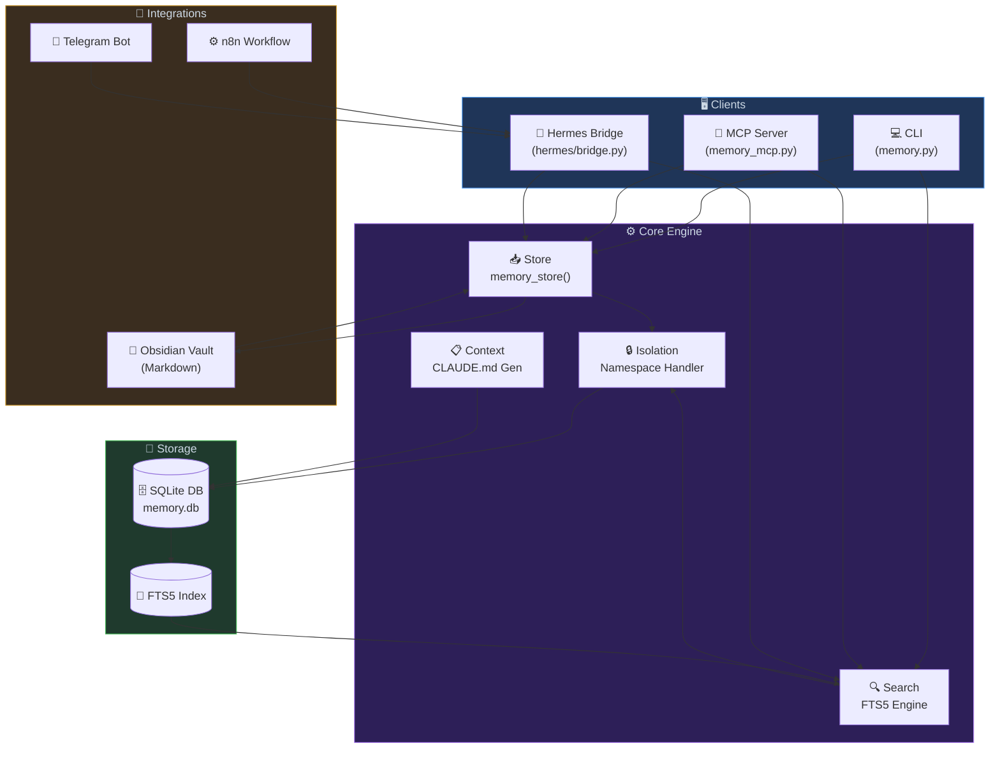
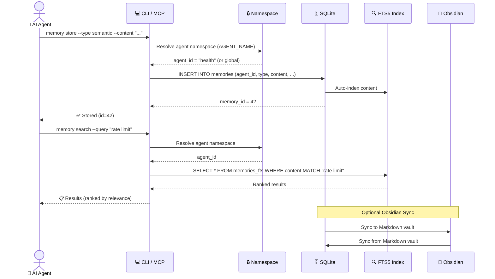
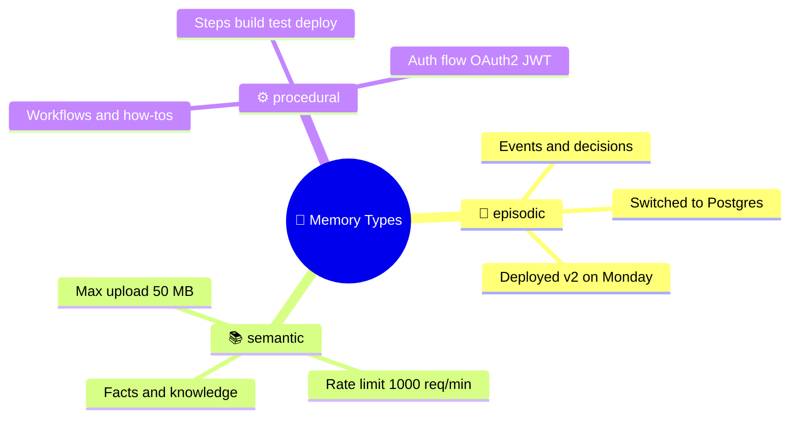
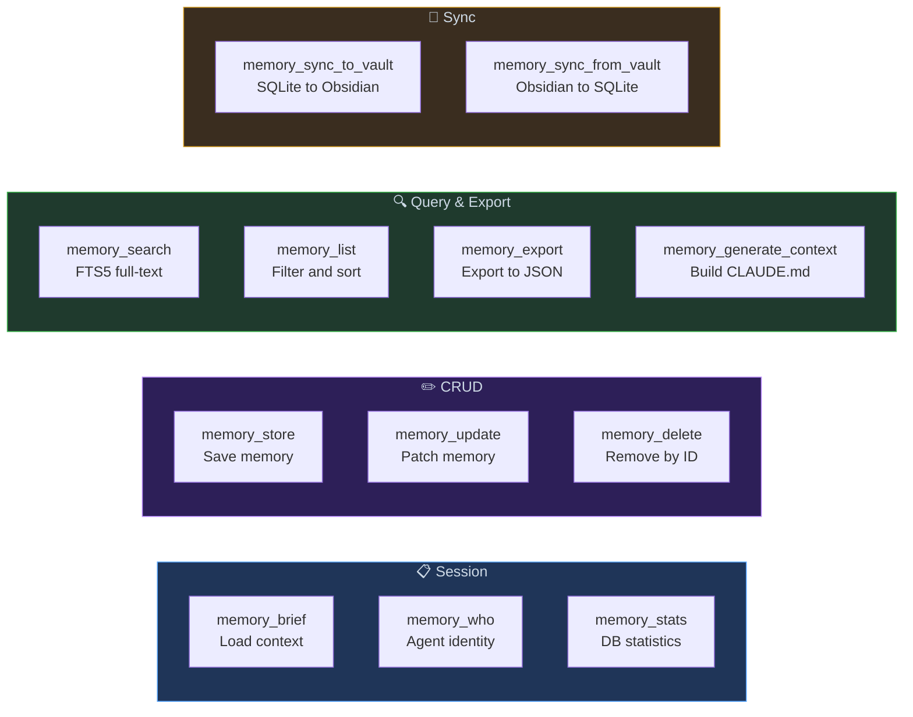
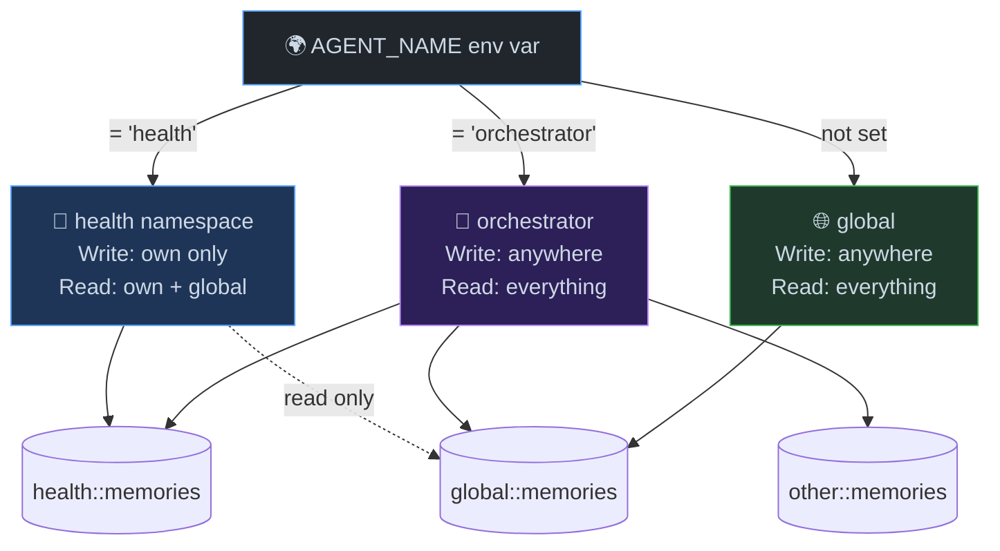
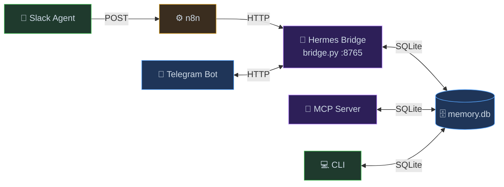

<div align="center">


# Agent Memory System

[](https://python.org)
[](LICENSE)
[](tests/)
[](requirements.txt)
[](memory_mcp.py)

**Persistent memory for AI agents using SQLite + FTS5.**  
Single-file core · Zero dependencies · Optional MCP server and Obsidian sync.

</div>

---

## ✨ Features

| Feature | Description |
|---------|-------------|
| 🗄️ **Persistent** | SQLite database survives process restarts |
| 🔍 **Full-text search** | FTS5 engine with ranked results |
| 🔒 **Agent isolation** | Each agent gets its own namespace automatically |
| 🛠️ **MCP Server** | 12 tools for Claude Code / Claude Desktop |
| 📝 **Obsidian sync** | Optional two-way Markdown bridge |
| 🤖 **CLAUDE.md generator** | Auto-inject context into every session |
| 🌍 **Cross-platform** | macOS, Linux, WSL, Windows |
| ⚡ **Zero dependencies** | Core uses only Python standard library |

---

## 🏗️ Architecture



---

## 🔄 Memory Lifecycle



---

## 🧠 Memory Types



---

## 🚀 Quick Start

### Option 1: CLI (zero dependencies)

```bash
cp memory.py /usr/local/bin/memory
chmod +x /usr/local/bin/memory

# Store a memory
memory store --type semantic --content "Max upload: 50 MB" --project api --importance 5

# Search memories
memory search --query "upload"

# List recent
memory list --project api --recent 10

# View stats
memory stats
```

### Option 2: MCP Server (Claude Code / Claude Desktop)

```bash
pip install mcp
```

Add to `~/.claude/settings.json` (Claude Code):

```json
{
  "mcpServers": {
    "agent-memory": {
      "command": "python",
      "args": ["/path/to/memory_mcp.py"]
    }
  }
}
```

> **Claude Desktop paths:**
> - macOS: `~/Library/Application Support/Claude/claude_desktop_config.json`
> - Windows: `%APPDATA%\Claude\claude_desktop_config.json`

Restart and you'll see **12 tools** available.

---

## 🛠️ MCP Tools



---

## 🔒 Agent Isolation



```bash
export AGENT_NAME=health   # Linux / macOS / WSL
$env:AGENT_NAME = "health" # Windows PowerShell
```

| Role | Write Access | Read Access |
|------|-------------|-------------|
| Regular agent | Own namespace only | Own + global |
| `orchestrator` | Anywhere | Everything |
| Not set | Anywhere | Everything |

---

## 🌉 Hermes — Cross-Platform Memory

> Two agents collaborate on Slack. You ask on Telegram. The memory carries.



```bash
# 1. Start the bridge
python hermes/bridge.py

# 2. Import hermes/n8n_workflow.json into your n8n instance

# 3. Start the Telegram bot
TELEGRAM_TOKEN=xxx HERMES_URL=http://your-server:8765 python hermes/telegram_bot.py
```

> See [hermes/README.md](hermes/README.md) for full setup, API reference, and VPS deployment.

---

## 📦 Obsidian Integration (Optional)

```bash
export OBSIDIAN_VAULT=/path/to/your/vault

# Auto-mirrors every store/update/delete to Markdown
memory store --type semantic --content "API uses JWT" --project api

# Bulk sync
memory sync-to-vault    # SQLite → Markdown
memory sync-from-vault  # Markdown → SQLite
```

---

## 📋 CLAUDE.md Generator

```bash
memory generate-context --output CLAUDE.md
```

Creates a Markdown file from your most important memories. Place it in your project root and Claude Code reads it automatically every session.

---

## 📁 File Structure

```
agent-memory/
├── memory.py              # Core: CLI + library (1282 lines)
├── memory_mcp.py          # MCP server (645 lines, requires: pip install mcp)
├── assets/
│   └── banner.svg         # Repository banner image
├── hermes/                # Cross-platform memory layer
│   ├── bridge.py          # HTTP gateway (zero new deps)
│   ├── telegram_bot.py    # Telegram recall bot (requires: requests)
│   ├── n8n_workflow.json  # Ready-to-import Slack → memory workflow
│   └── README.md          # Hermes setup guide
├── README.md
├── LICENSE
├── .gitignore
├── requirements.txt       # Runtime: empty (stdlib only)
├── requirements-dev.txt   # Dev: pytest, black, mypy, ruff
└── tests/
    ├── __init__.py
    └── test_memory.py     # 58 tests across 8 classes
```

---

## 🗃️ Database Location

| Platform | Default Path |
|----------|-------------|
| macOS / Linux | `~/.claude/memory/memory.db` |
| Windows | `%APPDATA%\\claude\\memory\\memory.db` |

Override: `export AGENT_MEMORY_DIR=/custom/path`

---

## 🧪 Testing

```bash
pip install -r requirements-dev.txt
python -m pytest tests/test_memory.py -v          # 58 tests
python -m pytest tests/test_memory.py -v --cov=memory
```

---

## 📄 License

[MIT](LICENSE) © khaled1174

---

<div align="center">
<sub>Built with ❤️ for AI agents that need to remember.</sub>
</div>
